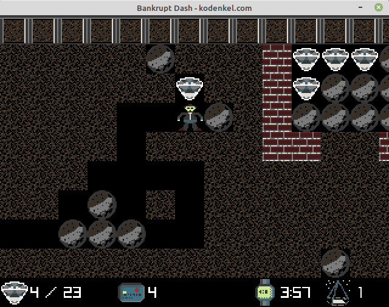

## Example Game: Bankrupt Dash

This is a Boulder Dash like game.

You are a green alien on the verge of bankruptcy, so you began mining for diamonds throughout the galaxy.

Explore what lies deep inside the crust of 5 different planets. Beware of the red alien beasts.

Press F2 in-game to see the detailed rules.



## Pre-requisites

- Java 1.8
- Maven 3.6

or newer

Help on my blog: <a href="https://www.kodenkel.com/how-to/java-jdk-maven-installation-windows" target="_blank">How To Install the Java JDK and Maven on Windows</a>

Debian/Ubuntu

````
sudo apt-get install default-jdk maven
````

## Package and Test

On Linux simply run the "package.sh" script.

On Windows simply run the "package.bat" script (untested).

The resulting jar will be executable and include all dependencies (so called "fat-jar").

To run the built jar manually:

````
java -jar kodenkel-scorched.jar
````
