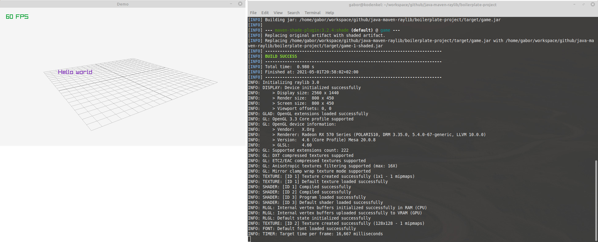
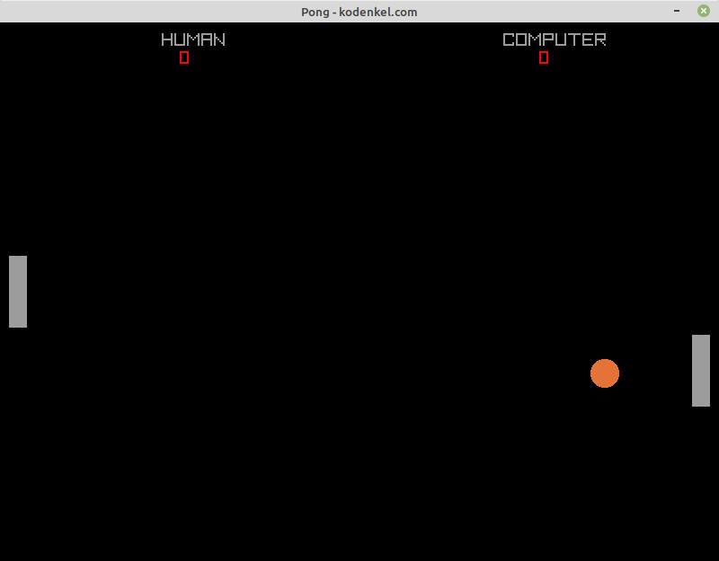
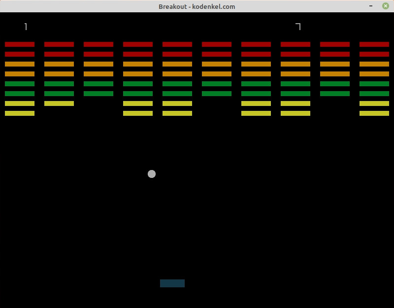

In this repository you can find a fully configured project for simple, old-school game development using Java and the bindings for Raylib (https://www.raylib.com/).

Bindings included in this: https://github.com/electronstudio/jaylib/



Now includes two example games as well: Pong, Breakout.

## Pre-requisites

- Java 1.8
- Maven 3.6

or newer

Help on my blog: <a href="https://www.kodenkel.com/how-to/java-jdk-maven-installation-windows" target="_blank">How To Install the Java JDK and Maven on Windows</a>

Debian/Ubuntu

````
sudo apt-get install default-jdk maven
````

## Package and Test

On Linux simply run the "package.sh" script.

On Windows simply run the "package.bat" script (untested).

The resulting jar will be executable and include all dependencies (so called "fat-jar").

To run the built jar manually:

````
java -jar game.jar
````

Or just double click on the jar!

## Main Class

The main class in the boilerplate project simply contains the default demo source of Raylib.

src/main/java/com/kodenkel/game/Application.java

Don't forget to update the Maven configuration (pom.xml) as well as paths to reflect your own preferred package names. **Do not use "com.kodenkel.game"!**

## Example Game: Pong

See the project in the games/pong sub-directory. This is a **very rudimentary** Pong clone.

Use the up/down keys to move the paddle. See the Application class to switch sides, or set which players are controlled by who, e.g.:

````
Pad playerHuman = new Pad(Player.HUMAN, Side.LEFT, WINDOW_WIDTH, WINDOW_HEIGHT);
Pad playerComputer = new Pad(Player.COMPUTER, Side.RIGHT, WINDOW_WIDTH, WINDOW_HEIGHT);
````



## Example Game: Breakout

See the project in the games/breakout sub-directory. This is a **very rudimentary** Breakout clone.

Use the mouse (slide it side to side) to move the paddle.

